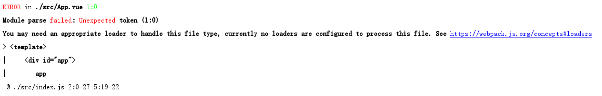

<crumbs config-path="zh/study/study-Vue-FreeHandCreateVueCli/_config.js"/>

# 4.1.vue-loader.md

安装 loader

```cmd
npm i vue-loader vue-template-compiler --save-dev
```

修改 webpack.config.js

```js
module.exports = {
    module: {
        rules: [{ test: /\.vue$/, use: "vue-loader" }]
    },
};
```

创建文件 `src/App.vue`

```vue
<template>
    <div id="app">
       app
    </div>
</template>

<script></script>
```

修改文件 `src/index.js`

```js
import Vue from 'vue'
import App from './App'

new Vue({
    render: h => h(App)
}).$mount('#app')
```

运行项目后，控制台会打印报错内容：



需要在 webpack.config.js 中添加如下内容：

```js
const VueLoaderPlugin = require("./node_modules/vue-loader/lib/plugin");

module.exports = {
    plugins: [
        new VueLoaderPlugin(),
    ],
};
```
